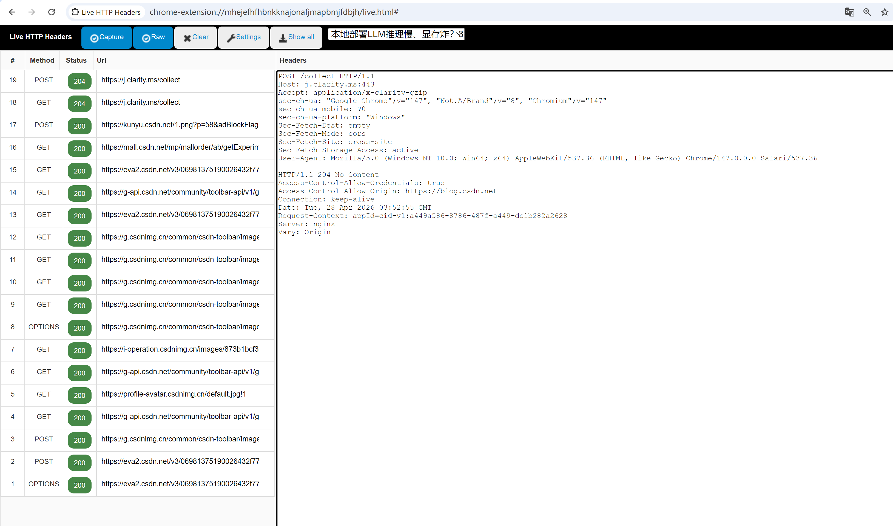

# Live HTTP Headers

A Chrome extension (Manifest V3) that monitors all HTTP/HTTPS traffic from your browser in real time.



## Features

- Real-time capture of HTTP request and response headers
- Filter traffic by browser tab
- Toggle capture on/off
- Raw and formatted header views
- Filter by request type (Document, XHR, Script, Image, etc.)
- Export all captured headers as plain text
- Settings persisted across sessions

## Installation

1. Clone or download this repository
2. Open Chrome and go to `chrome://extensions/`
3. Enable **Developer mode** (top right)
4. Click **Load unpacked** and select the `live-http-headers-v3.0/` folder

> **Note:** `google_allow_extension.reg` is only applicable when the extension is published to the Chrome Web Store with a fixed extension ID. For local development, Developer mode (step 3 above) is sufficient — no registry changes needed.

## Using google_allow_extension.reg (Enterprise / Policy Install)

This is only needed when deploying the extension via Windows Group Policy, not for local development.

**Step 1 — Get the extension ID**

After loading the extension via Developer mode, the ID is shown on the `chrome://extensions/` page under the extension name (e.g. `mhejefhfhbnkknajonafjmapbmjfdbjh`).

> The ID is derived from the folder path. It stays the same as long as the folder location doesn't change. Moving the folder or loading it on a different machine will generate a new ID.

**Step 2 — Update the .reg file**

Open `google_allow_extension.reg` and replace the ID value:

```reg
[HKEY_LOCAL_MACHINE\SOFTWARE\Policies\Google\Chrome\ExtensionInstallAllowlist]
"1"="<your-extension-id-here>"
```

**Step 3 — Apply the registry entry**

Double-click `google_allow_extension.reg` and confirm, or run as Administrator:

```bat
regedit /s google_allow_extension.reg
```

Restart Chrome after applying. Chrome will no longer show the "disable developer mode extensions" warning for this extension.

## Usage

1. Click the extension icon in the toolbar to open the Live HTTP Headers tab
2. Browse any website — requests appear in the list automatically
3. Click any row to inspect its full request and response headers
4. Use the **Tab Filter** dropdown to limit capture to a specific browser tab
5. Use **Settings** to choose which request types to capture and how to display headers
6. Use **Show all** to export all captured data as copyable text
7. Click **Clear** to reset the list

## Project Structure

```
live-http-headers-v3.0/
├── manifest.json     # MV3 extension config
├── background.js     # Service Worker — opens live.html on icon click
├── live.html         # Main UI
└── js/live.js        # All capture, display, and filter logic
```

## Version History

| Version | Notes |
|---------|-------|
| 3.0 | Migrated to Manifest V3, added Tab Filter, rewrote JS with DOM API |
| 1.7 | Original Manifest V2 release |
